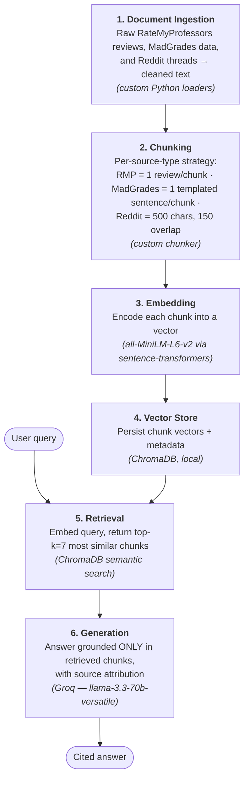

# Project 1 Planning: The Unofficial Guide

> Write this document before you write any pipeline code.
> Your spec and architecture diagram are what you'll use to direct AI tools (Claude, Copilot, etc.) to generate your implementation — the more specific they are, the more useful the generated code will be.
> Update the Retrieval Approach and Chunking Strategy sections if you change your approach during implementation.
> Update this file before starting any stretch features.

---

## Domain

<!-- What domain did you choose? Why is this knowledge valuable and hard to find through official channels? -->

Student-generated reviews of **Computer Sciences courses and professors at the University of
Wisconsin–Madison**. The system answers candid questions about teaching quality, exam and
workload difficulty, grading, and which electives are worth taking — the kind of advice
students trade on Reddit and Rate My Professors but that never appears in the official course
catalog. Official descriptions list topics and credits; they say nothing about whether a
professor's exams are fair, whether the curve is generous, or how a course *actually* feels to
sit through. This guide draws on three complementary source types: opinionated professor
reviews (Rate My Professors), factual grade-distribution data (MadGrades), and long-form peer
discussion (r/UWMadison), so it can both aggregate opinion and ground answers in real numbers.

---

## Documents

<!-- List your specific sources: URLs, subreddit names, forum threads, or file descriptions.
     Aim for at least 10 sources that together cover different subtopics or perspectives within your domain. -->

> Note: Rate My Professors review pages and Reddit threads are JavaScript-heavy / crawler-blocked,
> so during ingestion (Milestone 3) the review text will be saved into `documents/` as `.txt`/`.html`
> rather than fetched live. The Reddit rows below need real thread URLs pasted in — search
> r/UWMadison for the listed topics and drop the permalinks in. Verify which course each professor
> actually teaches before relying on it in the eval.

| # | Source | Description | URL or location |
|---|--------|-------------|-----------------|
| 1 | Rate My Professors | Remzi Arpaci-Dusseau (teaches CS 537, Operating Systems) | https://www.ratemyprofessors.com/professor/131676 |
| 2 | Rate My Professors | Florian Heimerl (ML / data visualization) | https://www.ratemyprofessors.com/professor/2776309 |
| 3 | Rate My Professors | Eric Bach (theory / algorithms) | https://www.ratemyprofessors.com/professor/125529 |
| 4 | Rate My Professors | Jin-Yi Cai (theory / complexity) | https://www.ratemyprofessors.com/professor/425160 |
| 5 | Rate My Professors | Gary Dahl | https://www.ratemyprofessors.com/professor/2770358 |
| 6 | MadGrades | CS 200 — Programming I (grade distribution) | https://madgrades.com/courses/3795cfcc-807e-3ca7-8348-d4a909a42f06 |
| 7 | MadGrades | CS 300 — Programming II (grade distribution) | https://madgrades.com/courses/07eabcce-fdab-3781-99ca-7dc2dc3544ae |
| 8 | MadGrades | CS 354 — Machine Organization & Programming (grade distribution) | https://madgrades.com/courses/cb48129f-99e6-36fa-9a20-46e0617e2499 |
| 9 | MadGrades | CS 540 — Intro to AI (grade distribution) | https://madgrades.com/courses/de8a0a8c-e076-3ec2-8b6c-e1e1ee82a53e |
| 10 | Reddit (r/UWMadison) | Thread: "Who do you think is the best professor in the CS department and why?" | https://www.reddit.com/r/UWMadison/comments/pfoc2b/who_do_you_think_is_the_best_professor_in_the_cs/ |
| 11 | Reddit (r/UWMadison) | Thread: "CS 537 OS" | https://www.reddit.com/r/UWMadison/comments/101k2gg/cs_537_os/ |
| 12 | Reddit (r/UWMadison) | Thread: "Best 500+ CS courses" | https://www.reddit.com/r/UWMadison/comments/qqjwyv/best_500_cs_courses/ |

---

## Chunking Strategy

<!-- How will you split documents into chunks?
     State your chunk size (in tokens or characters), overlap size, and explain why those
     numbers fit the structure of your documents.
     A review-heavy corpus warrants different chunking than a long FAQ. -->

I use three different chunking strategies, one per source type, because my documents vary widely
in structure.

**Chunk size:**

- **Rate My Professors** — One review per chunk (not a fixed character count). Each review is
  self-contained, so the review itself is the natural chunk boundary.
- **MadGrades** — One templated sentence per course. I first convert each course's grade data
  into a natural-language sentence, and each of those sentences becomes its own chunk.
- **Reddit** — Fixed-size chunks of 500 characters.

**Overlap:**

- **Rate My Professors** — None. No review builds on the context of another, so there is nothing
  to bridge between chunks.
- **MadGrades** — None. Each templated sentence is independent and does not draw context from the
  others.
- **Reddit** — 150 characters (~30%).

**Reasoning:**

- **Rate My Professors:** Since each review is self-contained — no review builds on context from
  another — I treat each review as its own chunk rather than splitting on a fixed size, and use
  no overlap.
- **MadGrades:** Grade data is tabular and can't be embedded meaningfully on its own, so I first
  template it into a natural-language sentence per course. Because these sentences are independent
  of one another, each serves as its own chunk with no overlap.
- **Reddit:** I use fixed-size chunking (500 characters) with 150 characters of overlap. Reddit
  comments often build on the context of earlier comments, so the overlap helps each chunk retain
  context from what came before. The overlap is also useful because Reddit comment length is
  highly variable — anywhere from a few words to several paragraphs — so the text isn't naturally
  fixed in size.

---

## Retrieval Approach

<!-- Which embedding model are you using (e.g., all-MiniLM-L6-v2 via sentence-transformers)?
     How many chunks will you retrieve per query (top-k)?
     If you were deploying this for real users and cost wasn't a constraint, what tradeoffs
     would you weigh in choosing a different embedding model — context length, multilingual
     support, accuracy on domain-specific text, latency? -->

**Embedding model:** `all-MiniLM-L6-v2` (via sentence-transformers). Although it is a small,
limited model, it does enough for this specific scenario: I don't have a large number of sources,
the individual documents are short (not a lot of comments or data in each), and everything is in
English — so it handles the job well.

**Top-k:** 7. Because my chunk sizes are fairly small, I retrieve a higher number of chunks to
make sure enough context is brought in for a relevant and accurate response to be generated.

**Production tradeoff reflection:** If cost weren't a constraint, I'd consider a model that
captures nuance better, since Rate My Professors and Reddit responses are written by humans using
a lot of nuanced, informal language rather than something written more factually — so capturing
that nuance would improve retrieval quality.

---

## Evaluation Plan

<!-- List your 5 test questions with their expected correct answers.
     Questions should be specific enough that you can judge whether the system's response
     is right or wrong. "What are good dining halls?" is too vague.
     "What do students say about wait times at [dining hall name] during lunch?" is testable. -->

> Expected answers below are drafts — confirm and tighten each one against the documents you
> actually collect (especially #3, which should match the real MadGrades number).

| # | Question | Expected answer |
|---|----------|-----------------|
| 1 | Which CS professor in my sources gives the most useful or detailed feedback? | A specific professor named, supported by review quotes praising feedback/clarity. Tests synthesis across multiple review docs. |
| 2 | Is CS 537 (Operating Systems) considered a hard course? | Yes — heavy workload, demanding projects (xv6/OS-TEP), but well-regarded. Tests opinion aggregation across reviews + Reddit. |
| 3 | What is the average GPA / grade distribution for CS 540? | The actual MadGrades figure (e.g., a specific average GPA / % A). Factual ground-truth — tests whether retrieval pulls the MadGrades doc, not opinion. |
| 4 | Which is more difficult, CS 537 (Operating Systems) or CS 577 (Algorithms)? | A comparison grounded in both courses' reviews; may surface contradictory opinions. Tests multi-course comparison. |
| 5 | Does Professor Ali Abedi curve exams? | **Not answerable** from the collected docs — the intended trap. Abedi does exist on Rate My Professors, but as a professor at *Waterloo*, not UW–Madison, so the corpus has no relevant reviews of him. Yet he really does teach CS 537 at UW–Madison — the *same course* as Remzi (source #1, who *is* in the corpus). The risk: semantic search retrieves Remzi's CS 537 reviews (same course, same OS/exam vocabulary) and the model **conflates the two professors**, inventing a curve for Abedi from Remzi's reviews. A grounded system should instead say it has no information on Abedi. This is the planned failure case — interesting because it tests conflation via plausible-but-wrong retrieval, not just an empty result. |

---

## Anticipated Challenges

<!-- What could go wrong? Name at least two specific risks with reasoning.
     Consider: noisy or inconsistent documents, missing source attribution, off-topic
     retrieval, chunks that split key information across boundaries. -->

1. **Hallucinated reviews on the Q5 (Ali Abedi) trap.** Abedi does exist on Rate My Professors,
   but as a professor at Waterloo — not at UW–Madison — so the corpus contains no relevant reviews
   of him. At the same time, he really does teach CS 537 at UW–Madison, and our index *does* contain
   reviews of other UW–Madison CS professors (including Remzi, who teaches the same course). That
   combination makes the model susceptible to hallucinating: rather than admitting it has no
   information on Abedi, it may pull reviews of other CS 537 professors and present them as if they
   were about him.

2. **Reddit comments losing their context.** Reddit threads frequently go off-topic, with random
   or tangential replies mixed into an otherwise on-topic discussion. When these comments get
   chunked, they can lose the context that made them meaningful, and off-topic fragments may be
   retrieved for queries they aren't actually relevant to.

---

## Architecture

<!-- Draw a diagram of your pipeline showing the five stages:
     Document Ingestion → Chunking → Embedding + Vector Store → Retrieval → Generation
     Label each stage with the tool or library you're using.
     You can use ASCII art, a Mermaid diagram, or embed a sketch as an image.
     You'll use this diagram as context when prompting AI tools to implement each stage. -->

> Stages 1–4 run once as an offline indexing pipeline; stages 5–6 run per user query at query time.

---

## AI Tool Plan

<!-- For each part of the pipeline below, describe:
     - Which AI tool you plan to use (Claude, Copilot, ChatGPT, etc.)
     - What you'll give it as input (which sections of this planning.md, which requirements)
     - What you expect it to produce
     - How you'll verify the output matches your spec

     "I'll use AI to help me code" is not a plan.
     "I'll give Claude my Chunking Strategy section and ask it to implement chunk_text()
     with my specified chunk size and overlap" is a plan. -->

**Milestone 3 — Ingestion and chunking:** I'll give Claude my Documents list (the 12 sources with
an explanation of what each one is) along with my Chunking Strategy section. I'll ask it to write a
`load_documents()` function to ingest and clean the raw text, plus chunking logic that applies the
correct strategy based on each document's source type — Rate My Professors, MadGrades, or Reddit.
I'm open to it splitting this into three separate functions (one per source type) if that's cleaner.
I'll verify the output by inspecting the resulting chunks: confirming that Rate My Professors chunks
are split one review per chunk, MadGrades chunks are well-formed templated sentences, and Reddit
chunks are roughly 500 characters with the expected overlap.

**Milestone 4 — Embedding and retrieval:** Once ingestion and chunking are working, I'll give Claude
my Retrieval Approach section and ask it to embed the chunks with `all-MiniLM-L6-v2`, store them in
ChromaDB, and implement a retrieval function that returns the top-k = 7 most similar chunks for a
query. I'll verify retrieval *before* adding the LLM by running a few of my evaluation questions and
checking that the chunks it returns are actually relevant — catching retrieval problems early, since
the LLM can't produce a good answer from bad chunks.

**Milestone 5 — Generation and interface:** I'll give Claude my grounding requirement — that the
answer must be drawn only from the retrieved chunks and must cite its sources — and ask it to write a
generation function that passes the top-7 chunks to the LLM with a system prompt enforcing that
grounding, and returns an answer with source attribution. I'll also have it build a simple UI so the
system is usable in a demo. I'll verify the full pipeline by running all five of my evaluation
questions end to end, paying particular attention to the Q5 trap (Ali Abedi) to confirm the system
declines to answer rather than hallucinating reviews from other professors.
